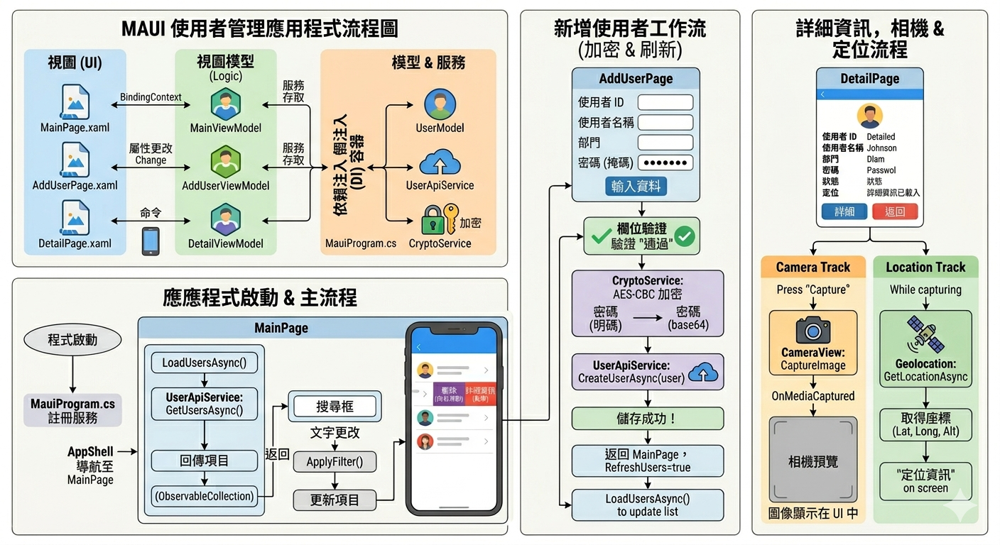

# 智慧環控處使用者管理系統

* Title      : Design and Implementation of a Personnel Information Management System with Camera and Geolocation Integration
* Author     : Chien-Hung Lin
* Conference : Homework_3
* Date       : 2026-05-07

  

## 摘要 (Abstract)

開發一個「智慧環控處使用者管理系統」畫面，透過公版專案提供的 HTTPS WebAPI 取得、顯示、新增與刪除 Comm_User 使用者資料。

本系統需具備使用者清單顯示、滑動刪除、使用者明細檢視、新增使用者、Email 格式驗證，以及密碼傳送前 AES Counter Mode 加密等功能。

# 功能需求

1.  主畫面使用者清單
    主畫面上方需顯示：

    左側：台塑網 Logo
    右側：標題文字「智慧環控處」
    下方：顯示 Comm_User 使用者清單

    使用者資料需透過公版專案提供的 HTTPS WebAPI 取得。
    清單顯示格式如下：
    [UserName] ([UserID]) [User_Dept]
    例如：
    王小明 (A001) 資訊處

2.  滑動刪除功能
    使用者清單項目需支援滑動操作。
    當使用者滑動項目時，需顯示「刪除」按鈕。
    點選刪除後：
    顯示確認訊息
    使用者確認後，透過 WebAPI 執行刪除
    若 WebAPI 回傳錯誤訊息，需顯示錯誤提示
    若刪除成功，需重新整理使用者清單

3.  使用者明細畫面
    點選清單中的任一使用者項目後，需進入使用者明細畫面。
    明細畫面需顯示以下資料：
    ID
    姓名
    部門
    使用者描述
    Email
    電話
    最後登入時間
    畫面最下方需提供「返回」按鈕，點選後返回主畫面。

4.  新增使用者功能
    主畫面需提供「新增」按鈕。
    點選後進入新增使用者畫面，並提供以下欄位讓使用者輸入：
    
    ID
    姓名
    部門
    使用者描述
    Email
    電話
    密碼
    新增畫面下方需提供「存檔」按鈕，左上方需提供返回功能。
    點選「存檔」後：
    檢查必填欄位
    檢查 Email 是否符合標準格式
    將密碼使用 AES Counter Mode 加密
    透過 HTTPS WebAPI 傳送新增資料
    若 WebAPI 回傳錯誤訊息，需提示錯誤並停留在新增畫面
    若新增成功，則返回主畫面並重新整理使用者清單

5.  Email 格式驗證
    在新增使用者時，需確認使用者輸入的 Email 符合標準格式。
    例如：
    user@example.com
    若 Email 格式不正確，系統需提示錯誤訊息，並停止送出資料。

6.  密碼加密\n
    在將密碼傳送至 WebAPI 前，需先使用：
    AES Counter Mode
    進行加密。
    目的為避免密碼以明文方式傳送，提高資料傳輸安全性。
    
## ◎ ISSUE
1. HTTPS SSL 憑證，怎麼迴避這個問題 ? OR 驗證
2. ssl 發行、server & crt 匯入 or 迴避
3. Community Toolkit 套件影片 or 網站

## 引文(Citation)：
Please cite the following if you make use of the code.

>@inproceedings{kye2026meta,
  title={Design and Implementation of a Personnel Information Management System with Camera and Geolocation Integration},
  author={Chien-Hung Lin},
  year={2026-04-05}
}
